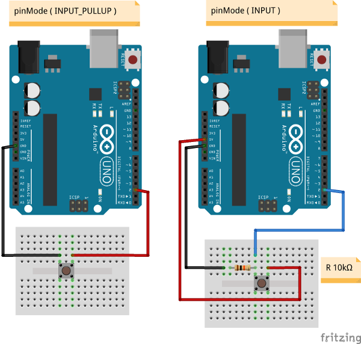

# Arduino_PushButton

It is an utility class for Push-Button, 
 with debouce sistem based on time that is configurable  
Very simple to use with two mode :    INPUT or INPUT_PULLUP  
You can pass a method() do you prefer to the constructor 

<code>
  Button*  button1 = new Button(PIN_BUTTON_1,  INPUT,  Method_1 );
</code>
 
<code>
  Button*  button2 = new Button(PIN_BUTTON_2,  INPUT_PULLUP,  Method_2 );
</code>

Check the example in the PushButtonExample folder

  

